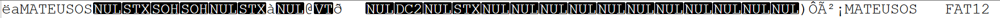
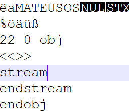
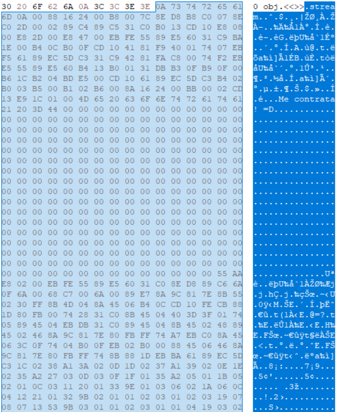
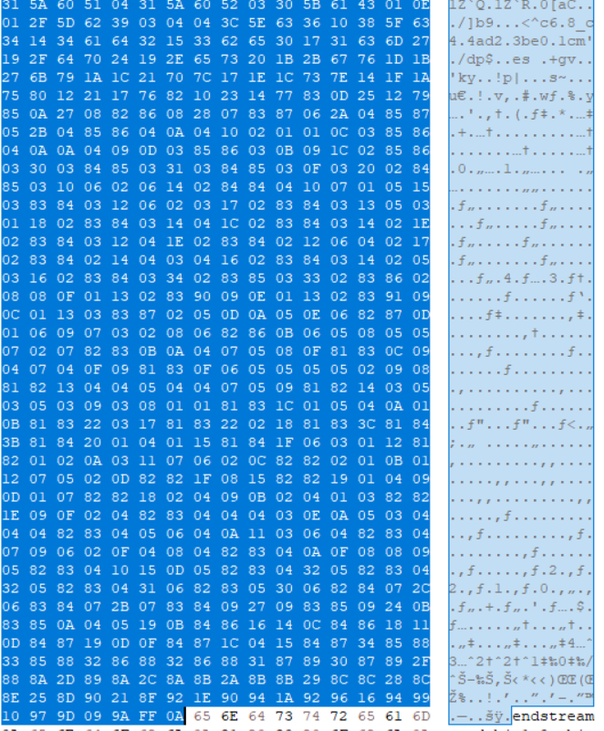
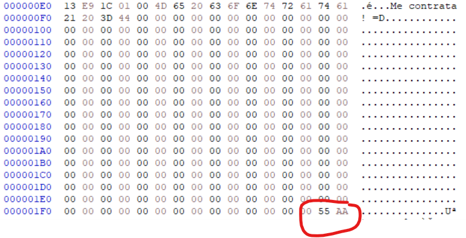

# MATEUSOS Bootloader

Este projeto implementa um bootloader simples escrito em Assembly x86 para o sistema de arquivos FAT12. O código é responsável por inicializar o modo gráfico, exibir uma mensagem e carregar uma segunda fase do bootloader.

## Recursos Implementados
- Configuração do setor de boot para FAT12.
- Inicialização do modo gráfico (320x200, 256 cores).
- Desenho de um fundo branco na tela.
- Exibição de uma mensagem na tela.
- Carregamento da segunda fase do bootloader (stage2).
- Algoritmo de desenho gráfico.

## Estrutura do Código
O código está dividido em várias seções:
1. **Cabeçalho do FAT12:** Define informações básicas do sistema de arquivos.
2. **Inicialização:** Configuração da pilha e registros necessários.
3. **Modo Gráfico:** Configuração do modo de vídeo 0x13.
4. **Renderização:** Desenha o fundo branco e exibe uma mensagem.
5. **Carregamento da Segunda Fase:** Lê os setores necessários do disco e transfere o controle.
6. **Stage2:** Responsável por renderizar elementos gráficos adicionais.

## Compilação e Execução

### Requisitos
- NASM (Netwide Assembler)
- QEMU ou Bochs (para emulação)

### Compilação
```sh
nasm -f bin bootloader.asm -o bootloader.bin
```
```sh
fasm FAMS.EXE bootloader.asm 
```

### Execução no QEMU
```sh
qemu-system-x86_64 -drive format=raw,file=bootloader.bin
```

## Estrutura do FAT12
O código segue o formato do setor de boot do FAT12, incluindo:
- `OEMname`: Nome do fabricante.
- `byterPerSector`: Tamanho do setor.
- `sectPerCluster`: Número de setores por cluster.
- `reservedSectors`: Número de setores reservados.
- `numFATs`: Número de tabelas FAT.
- `numRootDirEntries`: Número de entradas no diretório raiz.
- `numSectors`: Número total de setores.
- `fileSysType`: Indicação de FAT12.

## Mensagem Exibida
A mensagem `Me contrata! =D` é renderizada na tela após a inicialização do bootloader.

## Inserindo o bootloader no PDF

Primeiro passo é passar o cabeçalho do seu aquivo.bin. Faça isso com um editor Hexadecimal. 


Depois cole inserindo no seu arquivo PDF no editor hexadecimal também.


No seu arquivo PDF vai ver os bytes inseridos:




Voce precisa ver quantas tabelas de refencias tem seu pdf. Na imagem mostra xref 0 22, ou seja, 22 tabelas.

Depois de verifcar quantas tabelas tem no seu PDF, coloque no inicio quantas tabelas e crie um obj.



```sh
22 0 obj
<<>>
stream
endstream
endobj
```

Dentro do stream e endstream você tem que colocar os bytes do seu código .bin





É só copiar e colar no mesmo lugar, talvez tenha que inserir alguns bytes e verificar a assinatura corretamente.



Qualquer dúvida, baixe o arquivo pdf [text](<../../Lorem ipsum dolor.pdf>) e veja em um editor hexadecimal para ver como esta.

Imagem no arquivo:


